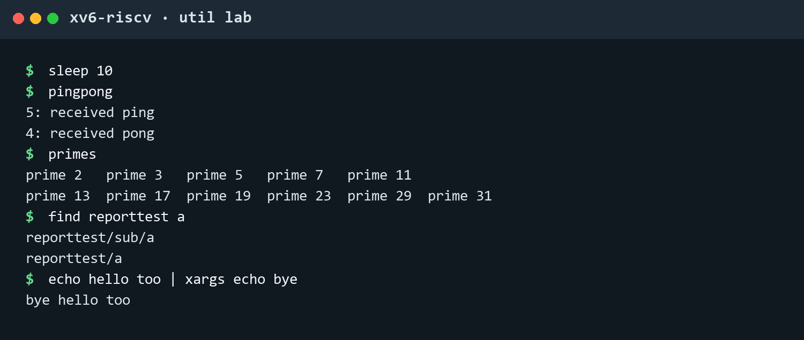
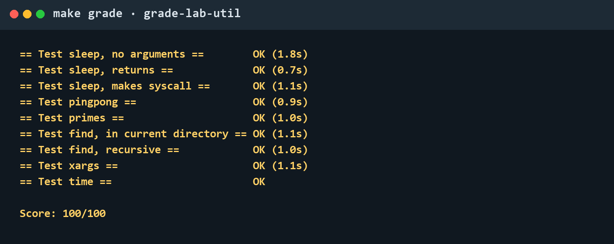

# 操作系统课程设计实验报告

## 阅读导航

- [Lab 1：Unix Utilities](#lab-1unix-utilities)
  - [一、实验目的](#一实验目的)
  - [二、实验内容](#二实验内容)
  - [三、实验结果与分析](#三实验结果与分析)
  - [四、实验中遇到的问题及解决方法](#四实验中遇到的问题及解决方法)
  - [五、实验心得](#五实验心得)

## Lab 1：Unix Utilities

### 一、实验目的

本实验基于 MIT `xv6-labs-2021` 的 `util` 分支，在 xv6 用户空间实现五个 Unix 实用程序。主要目标如下：

1. 掌握 xv6 用户程序从编写、交叉编译、写入文件系统镜像到在 QEMU 中运行的完整流程。
2. 熟悉 `main(int argc, char *argv[])` 的参数组织方式，能够完成参数检查、字符串转换和错误处理。
3. 掌握 `sleep`、`fork`、`pipe`、`read`、`write`、`close`、`wait`、`exec`、`open` 和 `fstat` 等接口。
4. 理解父子进程的执行关系以及文件描述符在 `fork()` 前后的继承行为。
5. 掌握使用两条单向管道实现双向进程通信的方法。
6. 理解并发素数筛中的进程流水线和基于 EOF 的终止机制。
7. 掌握 xv6 目录项的读取、路径拼接和递归目录遍历。
8. 理解 `fork + exec + wait` 的命令执行模式，以及标准输入到参数数组的转换过程。
9. 完成 `sleep`、`pingpong`、`primes`、`find` 和 `xargs`，并通过官方评分程序。

项目代码仓库：<https://github.com/kinosakuraxuan/learn_for_xv6>

### 二、实验内容

#### 1. 实验环境与项目准备

本实验使用的环境如下：

```text
宿主系统：Windows + WSL 2
Linux：Ubuntu 22.04
实验版本：xv6-labs-2021
实验分支：util
目标架构：RISC-V 64 位
编译器：riscv64-linux-gnu-gcc
模拟器：QEMU
本地目录：/home/kino/os-design/xv6-labs-2021
```

进入 Ubuntu 后切换到项目目录，并确认当前分支：

```bash
cd ~/os-design/xv6-labs-2021
git branch --show-current
```

执行以下命令编译并启动 xv6：

```bash
make qemu
```

当终端出现以下内容时，说明 xv6 已经成功启动：

```text
xv6 kernel is booting
init: starting sh
$
```

Ubuntu shell 与 xv6 shell 属于两个不同的运行环境：源码编辑、编译和评分在 Ubuntu 中进行；实验程序在 xv6 的 `$` 提示符中运行。

#### 2. 新增用户程序并加入构建系统

本实验在 `user` 目录中新增以下文件：

```text
user/sleep.c
user/pingpong.c
user/primes.c
user/find.c
user/xargs.c
```

随后在项目根目录的 `Makefile` 中将五个程序加入 `UPROGS`：

```makefile
	$U/_sleep\
	$U/_pingpong\
	$U/_primes\
	$U/_find\
	$U/_xargs\
```

这里的 `$U` 表示 `user` 目录，下划线开头的名称是构建阶段生成的可执行程序。进入 xv6 后直接运行 `sleep`、`pingpong` 等命令，不需要输入下划线。

#### 3. 实现 sleep

`sleep` 接收一个 tick 数，并调用 xv6 已有的 `sleep()` 系统调用暂停当前进程。程序首先检查参数数量，再使用 `atoi()` 将字符串参数转换为整数。

关键代码如下：

```c
if(argc != 2){
  fprintf(2, "usage: sleep ticks\n");
  exit(1);
}

ticks = atoi(argv[1]);
if(ticks < 0){
  fprintf(2, "sleep: ticks must be non-negative\n");
  exit(1);
}

sleep(ticks);
exit(0);
```

该程序只负责解析参数和发起系统调用。真正的计时、进程阻塞、调度以及唤醒过程由 xv6 内核完成。相比用户态忙等待，调用系统服务不会持续占用 CPU。

#### 4. 实现 pingpong

xv6 的匿名管道是单向的，其中 `fd[0]` 为读取端，`fd[1]` 为写入端。为了让父子进程实现一次往返通信，程序创建两条管道：

```text
parent_to_child：父进程写入，子进程读取
child_to_parent：子进程写入，父进程读取
```

通信顺序如下：

```text
父进程写入 1 字节
        │
        ▼
子进程读取并输出 received ping
        │
        ▼
子进程把字节写回父进程
        │
        ▼
父进程读取并输出 received pong
```

核心实现如下：

```c
pipe(parent_to_child);
pipe(child_to_parent);
pid = fork();

if(pid == 0){
  close(parent_to_child[1]);
  close(child_to_parent[0]);

  read(parent_to_child[0], &byte, 1);
  printf("%d: received ping\n", getpid());
  write(child_to_parent[1], &byte, 1);
  exit(0);
}

close(parent_to_child[0]);
close(child_to_parent[1]);
write(parent_to_child[1], &byte, 1);
read(child_to_parent[0], &byte, 1);
printf("%d: received pong\n", getpid());
wait(0);
```

父进程只有在子进程写回数据后才能结束 `read()`，因此输出顺序稳定为 `ping` 在前、`pong` 在后。父子进程还需要关闭不使用的管道端，避免资源泄漏或 EOF 无法到达。

#### 5. 实现 primes

`primes` 使用进程和管道构造并发素数筛。主进程将 2～35 写入第一条管道，每一级筛选进程执行以下操作：

1. 从输入管道读取第一个整数，将其作为当前素数并输出；
2. 创建下一条管道和子进程；
3. 过滤掉能够被当前素数整除的整数；
4. 将剩余整数写入下一条管道；
5. 关闭写入端，通过 EOF 通知下一级数据已经结束；
6. 使用 `wait(0)` 回收下一级子进程。

筛选过程可以表示为：

```text
生成 2～35
    │
    ▼
输出 2，过滤 2 的倍数
    │
    ▼
输出 3，过滤 3 的倍数
    │
    ▼
输出 5，过滤 5 的倍数
    │
    ▼
继续建立后续筛选进程
```

单级筛选的关键代码如下：

```c
if(read(input_fd, &prime, sizeof(prime)) != sizeof(prime)){
  close(input_fd);
  exit(0);
}

printf("prime %d\n", prime);
pipe(next_pipe);
pid = fork();

if(pid == 0){
  close(input_fd);
  close(next_pipe[1]);
  sieve(next_pipe[0]);
}

close(next_pipe[0]);
while(read(input_fd, &number, sizeof(number)) == sizeof(number)){
  if(number % prime != 0)
    write(next_pipe[1], &number, sizeof(number));
}

close(input_fd);
close(next_pipe[1]);
wait(0);
```

管道写端的关闭是本程序的终止协议。如果仍有进程持有写端，下一级即使已经读完现有数据，也会继续阻塞等待，无法结束递归进程链。

#### 6. 实现 find

`find` 从指定路径开始遍历目录树，并输出名称匹配的文件路径。程序使用 `open()` 打开路径，使用 `fstat()` 判断类型；遇到目录时通过 `read()` 依次读取 `struct dirent`。

主要步骤如下：

1. 检查路径长度，避免超过 512 字节缓冲区；
2. 把当前路径复制到缓冲区，并在末尾追加 `/`；
3. 读取目录项并跳过 inode 编号为 0 的无效项；
4. 跳过 `.` 和 `..`，避免递归循环；
5. 为固定长度目录名补充字符串结束符；
6. 对拼接得到的子路径递归调用 `find()`；
7. 遇到普通文件时比较最后一级名称，匹配则输出完整路径。

目录遍历的关键代码如下：

```c
while(read(fd, &entry, sizeof(entry)) == sizeof(entry)){
  if(entry.inum == 0)
    continue;

  memmove(name, entry.name, DIRSIZ);
  name[DIRSIZ] = 0;

  if(strcmp(name, ".") == 0 || strcmp(name, "..") == 0)
    continue;

  find(buffer, target);
}
```

`entry.name` 是长度为 `DIRSIZ` 的固定数组，不应假设其中一定存在自然的 `\0`。因此复制后必须手动终止字符串，否则 `strcmp()` 等函数可能读取到缓冲区之外。

#### 7. 实现 xargs

`xargs` 从文件描述符 0 逐字符读取标准输入，遇到换行符后得到一行完整输入。程序把该行按照空格、制表符和回车拆分成若干参数，并将这些参数追加到原命令之后。

每处理一行，程序都使用以下执行模式：

```text
xargs 父进程
  ├─ fork 创建子进程
  │    └─ exec 执行目标命令
  └─ wait 等待子进程结束，再读取下一行
```

逐行读取的关键代码如下：

```c
while((bytes_read = read(0, &character, 1)) == 1){
  if(character == '\n'){
    line[length] = 0;
    run_command(argc, argv, line);
    length = 0;
    continue;
  }

  if(length >= LINE_SIZE - 1){
    fprintf(2, "xargs: input line too long\n");
    exit(1);
  }
  line[length++] = character;
}

if(length > 0){
  line[length] = 0;
  run_command(argc, argv, line);
}
```

最后一行可能直接以 EOF 结束而没有换行符，所以读取循环结束后还要检查 `length`。构造 `exec()` 参数时还必须确保参数总数小于 `MAXARG`，并在数组末尾设置空指针。

#### 8. 编译、运行与评分

完成所有程序后，在 Ubuntu 中执行：

```bash
cd ~/os-design/xv6-labs-2021
make qemu
```

进入 xv6 后执行以下测试：

```sh
sleep 10
pingpong
primes
find reporttest a
echo hello too | xargs echo bye
```

实际运行结果如下：



*图 1-1 五个程序的典型运行结果*

退出 QEMU 后，在 Ubuntu 项目根目录运行官方评分程序：

```bash
make grade
```

官方评分结果如下：



*图 1-2 grade-lab-util 官方评分结果*

### 三、实验结果与分析

官方 `grade-lab-util` 的测试结果如下：

| 程序 | 测试内容 | 结果 |
| --- | --- | --- |
| `sleep` | 无参数处理 | OK |
| `sleep` | 正常休眠并返回 | OK |
| `sleep` | 实际调用系统调用 | OK |
| `pingpong` | 父子进程双向传递字节 | OK |
| `primes` | 输出 2～35 范围内全部素数 | OK |
| `find` | 当前目录查找 | OK |
| `find` | 递归目录查找 | OK |
| `xargs` | 标准输入转换为命令参数 | OK |
| `time.txt` | 实验耗时文件格式 | OK |

最终成绩：`Score: 100/100`。

测试结果说明：

1. `sleep` 的 makes syscall 测试通过，表明程序调用了内核提供的系统服务，而不是在用户态自行等待。
2. `pingpong` 输出顺序正确，证明父子进程的两条管道方向和同步关系设置正确。
3. `primes` 输出结果完整，说明多级筛选进程能够正确传递整数，并在写端关闭后依靠 EOF 逐级结束。
4. `find` 同时通过当前目录和递归测试，说明路径拼接、目录项读取以及特殊目录过滤正确。
5. `xargs` 测试通过，说明输入分行、参数拆分、`fork()`、`exec()` 和 `wait()` 能够正确协同。

综合来看，五个程序均能够在 xv6 中正确编译和运行，输出格式满足实验要求。

### 四、实验中遇到的问题及解决方法

1. **容易混淆 Ubuntu shell 与 xv6 shell。**

   `make`、Git 和交叉编译工具位于 Ubuntu 中，不能在 xv6 的 `$` 提示符中执行。正确流程是在 Ubuntu 中运行 `make qemu`，进入 xv6 测试程序，再使用 `Ctrl+A`、`X` 退出 QEMU，返回 Ubuntu 后运行 `make grade`。

2. **管道写端没有关闭会导致进程阻塞。**

   只要仍有进程持有某条管道的写端，读取进程就不能确定后续是否还有数据。解决方法是让父子进程在 `fork()` 后立即关闭不使用的端点，并在完成写入后关闭当前写端。

3. **开始时对 `fork()` 返回值理解不完整。**

   `fork()` 在子进程中返回 0，在父进程中返回子进程 PID，失败时返回负数。当前进程自己的 PID 需要使用 `getpid()` 获取。利用返回值差异，父子进程可以从同一位置继续执行不同任务。

4. **primes 的进程链可能无法正常退出。**

   如果当前筛选进程提前 `wait()`，或者下一条管道的写端未关闭，进程链可能发生阻塞。解决方法是先完成所有过滤和写入，关闭输入与输出描述符，再等待下一级进程结束。

5. **find 容易进入无限递归。**

   每个目录都包含 `.` 和 `..`。如果直接对所有目录项递归，程序会反复进入当前目录或父目录。递归前必须显式跳过这两个名称。

6. **目录项名称不一定自然终止。**

   `struct dirent` 中的名称长度固定为 `DIRSIZ`。复制名称后需要手动写入 `\0`，同时在拼接路径前检查缓冲区剩余空间。

7. **xargs 可能丢失最后一行。**

   标准输入的最后一行不一定以换行符结束。如果只在读到 `\n` 时执行命令，EOF 前的最后一组参数会被丢弃。读取循环结束后应再次检查缓冲区中是否存在剩余字符。

8. **配置个人 Git 远程仓库。**

   本地仓库最初的 `origin` 指向 MIT 官方仓库。为了同时保留上游代码来源并提交个人实验，将 MIT 远程重命名为 `upstream`，再把个人 GitHub 仓库设置为新的 `origin`：

   ```bash
   cd ~/os-design/xv6-labs-2021
   git remote rename origin upstream
   git remote add origin https://github.com/kinosakuraxuan/learn_for_xv6.git
   git push -u origin util
   ```

### 五、实验心得

本实验是对 xv6 用户态编程接口的一次综合练习。通过 `sleep`，我理解了用户程序主要负责处理输入并通过系统调用请求内核服务；通过 `pingpong` 和 `primes`，我进一步理解了 `fork()` 后父子进程的关系、管道缓冲区的 FIFO 特性，以及关闭文件描述符对阻塞和 EOF 的影响。

`find` 展示了文件系统接口的基本用法。目录可以像文件一样被打开和读取，目录遍历实际是读取一系列目录项、构造新路径并判断文件类型。`xargs` 则把标准输入、命令行参数、`fork()`、`exec()` 和 `wait()` 连接起来，体现了 Unix 小工具通过管道组合完成复杂任务的设计思想。

实验过程中最明显的体会是，系统程序的正确性往往取决于资源生命周期和边界细节。一个未关闭的写端可能让整个进程链无法退出；遗漏 `.` 和 `..` 会导致无限递归；缺少字符串结束符会造成越界读取；参数数组没有空指针终止则无法正确调用 `exec()`。官方测试最终获得 `100/100`，说明当前实现满足 Lab 1 的功能要求，也为后续分析和修改 xv6 内核奠定了基础。

## 参考资料

1. MIT PDOS, [Lab: Xv6 and Unix utilities](https://pdos.csail.mit.edu/6.828/2021/labs/util.html)
2. MIT PDOS, [xv6: a simple, Unix-like teaching operating system](https://pdos.csail.mit.edu/6.828/2021/xv6.html)
3. 参考报告格式：[xv6-operating-systems-course-design](https://github.com/lzndXJ/xv6-operating-systems-course-design)
