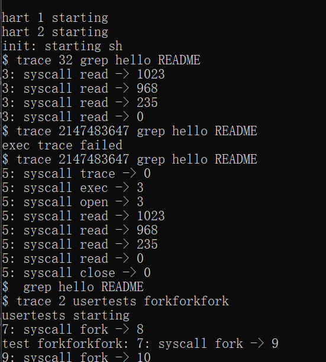
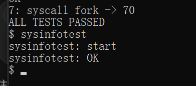
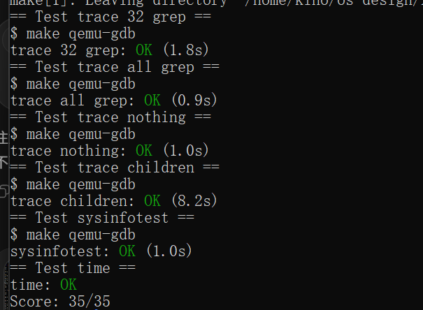

# 操作系统课程设计实验报告

## 阅读导航

- [Lab 2：System Calls](#lab-2system-calls)
  - [一、实验目的](#一实验目的)
  - [二、实验内容](#二实验内容)
  - [三、实验结果与分析](#三实验结果与分析)
  - [四、实验中遇到的问题及解决方法](#四实验中遇到的问题及解决方法)
  - [五、实验心得](#五实验心得)

## Lab 2：System Calls

### 一、实验目的

本实验基于 MIT `xv6-labs-2021` 的 `syscall` 分支，在 xv6 内核中实现 `trace` 和 `sysinfo` 两个系统调用。主要目标如下：

1. 理解 xv6 系统调用从用户态接口、RISC-V `ecall`、内核分派表到具体处理函数的完整路径。
2. 掌握系统调用号、用户态函数声明、汇编桩和内核处理函数的注册方法。
3. 使用位掩码实现按系统调用编号选择性跟踪，并输出进程号、调用名称和返回值。
4. 理解进程控制块中的状态归属，以及父进程的跟踪掩码在 `fork()` 时向子进程继承的机制。
5. 掌握在持锁条件下遍历物理页空闲链表和全局进程表的方法。
6. 理解用户虚拟地址与内核地址空间的边界，掌握使用 `copyout()` 向用户空间安全返回结构体的方法。
7. 完成官方测试，并分析 `trace` 与 `sysinfo` 的正确性和边界行为。

项目代码仓库：<https://github.com/kinosakuraxuan/learn_for_xv6>

### 二、实验内容

#### 1. 实验环境与项目准备

本实验使用的环境如下：

```text
宿主系统：Windows + WSL 2
Linux：Ubuntu 22.04
实验版本：xv6-labs-2021
实验分支：syscall
目标架构：RISC-V 64 位
编译器：riscv64-linux-gnu-gcc
模拟器：QEMU
本地目录：/home/kino/os-design/xv6-labs-2021
```

进入 Ubuntu 后切换到统一的 xv6 仓库，并确认当前分支：

```bash
cd ~/os-design/xv6-labs-2021
git checkout syscall
git branch --show-current
```

完成修改后执行以下命令重新编译并启动 xv6：

```bash
make clean
make qemu
```

源码编辑、编译和官方评分都在 Ubuntu shell 中进行；`trace` 和 `sysinfotest` 则在 QEMU 启动后的 xv6 `$` 提示符中运行。

#### 2. 注册 trace 与 sysinfo 系统调用

一个新的系统调用需要同时打通用户态接口与内核态分派路径。本实验主要修改以下位置：

```text
user/user.h        用户态函数声明
user/usys.pl       生成执行 ecall 的汇编桩
kernel/syscall.h   分配系统调用号
kernel/syscall.c   注册内核处理函数
kernel/sysproc.c   实现 sys_trace 和 sys_sysinfo
```

用户态声明与汇编桩如下：

```c
// user/user.h
struct sysinfo;
int trace(int);
int sysinfo(struct sysinfo *);
```

```perl
# user/usys.pl
entry("trace");
entry("sysinfo");
```

在 `kernel/syscall.h` 中为两个调用分配编号，并在 `kernel/syscall.c` 的 `syscalls[]` 中建立编号到处理函数的映射：

```c
#define SYS_trace   22
#define SYS_sysinfo 23

[SYS_trace]   sys_trace,
[SYS_sysinfo] sys_sysinfo,
```

`usys.pl` 生成的汇编桩会把系统调用号写入寄存器 `a7`，然后执行 `ecall`。进入内核后，`syscall()` 从当前进程的 `trapframe->a7` 取得编号，调用分派表中的对应函数，并把返回值写回 `trapframe->a0`。

#### 3. 实现 trace 系统调用

`trace(mask)` 使用位掩码选择需要跟踪的系统调用。若第 `num` 位为 1，则在该系统调用执行结束后输出进程号、系统调用名称和返回值。

首先在 `struct proc` 中增加进程私有的掩码字段：

```c
struct proc {
  // ...
  int trace_mask;  // System calls traced by this process
};
```

`sys_trace()` 读取用户传入的整数并保存到当前进程控制块：

```c
uint64
sys_trace(void)
{
  int mask;

  if(argint(0, &mask) < 0)
    return -1;
  myproc()->trace_mask = mask;
  return 0;
}
```

在 `allocproc()` 和 `freeproc()` 中把 `trace_mask` 清零，避免进程槽复用时残留上一个进程的跟踪状态。在 `fork()` 中复制该字段，使子进程继承父进程的跟踪策略：

```c
// kernel/proc.c: fork()
np->trace_mask = p->trace_mask;
```

系统调用执行完成后，根据掩码决定是否输出记录：

```c
p->trapframe->a0 = syscalls[num]();
if(p->trace_mask & (1U << num))
  printf("%d: syscall %s -> %d\n", p->pid,
         syscall_names[num], (int)p->trapframe->a0);
```

例如 `read` 的系统调用号是 5，因此 `trace 32` 等价于设置 `1 << SYS_read`，只跟踪 `read`。掩码 `2147483647` 的低 31 位均为 1，可以覆盖当前已有系统调用。

#### 4. 实现空闲物理内存统计

xv6 的物理页分配器使用 `kmem.freelist` 保存空闲页，每个节点代表一个大小为 `PGSIZE` 的物理页。`freemem()` 在持有 `kmem.lock` 时遍历空闲链表，并累计可分配的字节数：

```c
uint64
freemem(void)
{
  uint64 bytes = 0;
  struct run *r;

  acquire(&kmem.lock);
  for(r = kmem.freelist; r; r = r->next)
    bytes += PGSIZE;
  release(&kmem.lock);

  return bytes;
}
```

统计过程中必须持锁，否则另一个 CPU 可能同时执行 `kalloc()` 或 `kfree()`，导致链表发生变化并产生不一致结果。

#### 5. 实现活动进程统计与结果复制

`nproc()` 遍历全局 `proc` 表，并统计状态不等于 `UNUSED` 的进程槽。每个进程的 `state` 都受自己的 `p->lock` 保护，因此读取前后分别获取和释放该锁：

```c
uint64
nproc(void)
{
  uint64 count = 0;
  struct proc *p;

  for(p = proc; p < &proc[NPROC]; p++){
    acquire(&p->lock);
    if(p->state != UNUSED)
      count++;
    release(&p->lock);
  }

  return count;
}
```

`sys_sysinfo()` 先在内核栈中构造 `struct sysinfo`，再通过当前进程页表把结果复制到用户地址：

```c
uint64
sys_sysinfo(void)
{
  uint64 addr;
  struct sysinfo info;
  struct proc *p = myproc();

  if(argaddr(0, &addr) < 0)
    return -1;

  info.freemem = freemem();
  info.nproc = nproc();
  if(copyout(p->pagetable, addr, (char *)&info,
             sizeof(info)) < 0)
    return -1;

  return 0;
}
```

用户传入的是用户虚拟地址，内核不能把它当作普通内核指针直接解引用。`copyout()` 会完成页表转换并检查目标映射是否有效；若地址不可写或跨越无效映射，系统调用返回 `-1`。

#### 6. 加入构建系统

在项目根目录的 `Makefile` 中将实验程序加入 `UPROGS`：

```makefile
	$U/_trace\
	$U/_sysinfotest\
```

这里的下划线名称是编译阶段生成的用户程序。在 xv6 shell 中运行时直接输入 `trace` 或 `sysinfotest`，不需要输入下划线。

#### 7. 编译、运行与评分

在 Ubuntu 中执行：

```bash
cd ~/os-design/xv6-labs-2021
git checkout syscall
make clean
make qemu
```

进入 xv6 后执行以下测试：

```sh
trace 32 grep hello README
trace 2147483647 grep hello README
trace 2 usertests forkforkfork
sysinfotest
```

`trace` 的实际运行结果如下：



*图 2-1 trace 系统调用的现场运行结果*

`sysinfotest` 的实际运行结果如下：



*图 2-2 sysinfotest 现场运行结果*

按 `Ctrl+A`、`X` 退出 QEMU 后，在 Ubuntu 项目根目录运行官方评分程序：

```bash
make grade
```

官方评分结果如下：



*图 2-3 grade-lab-syscall 官方评分结果*

### 三、实验结果与分析

官方 `grade-lab-syscall` 的测试结果如下：

| 测试项目 | 验证内容 | 结果 |
| --- | --- | --- |
| `trace 32 grep` | 仅跟踪 `read` 系统调用 | OK |
| `trace all grep` | 跟踪当前已有的全部系统调用 | OK |
| `trace nothing` | 未启用跟踪的程序不产生跟踪输出 | OK |
| `trace children` | `fork()` 后子孙进程继承跟踪掩码 | OK |
| `sysinfotest` | 空闲内存和非空闲进程数统计 | OK |
| `time.txt` | 实验耗时文件格式 | OK |

最终成绩：`Score: 35/35`。

测试结果说明：

1. `trace 32 grep` 只输出 `read`，证明位掩码判断和系统调用编号映射正确。
2. `trace all grep` 能输出 `trace`、`exec`、`open`、`read` 和 `close` 等调用，证明名称表和分派表能够覆盖现有调用。
3. `trace nothing` 通过，说明掩码属于单个进程，没有污染系统中的其他进程。
4. `trace children` 通过，证明 `fork()` 正确复制了父进程的 `trace_mask`。
5. `sysinfotest` 会通过申请与释放内存、创建进程检查统计值变化。测试通过说明空闲页统计、进程计数、锁保护和 `copyout()` 行为均正确。

综合来看，两个系统调用均能够正确编译和运行，返回值及输出格式满足实验要求。

### 四、实验中遇到的问题及解决方法

1. **系统调用注册环节较多，容易遗漏。**

   新增系统调用需要同步修改 `user.h`、`usys.pl`、`syscall.h`、`syscall.c` 和具体处理文件。若遗漏任一位置，可能出现用户程序无法链接、未知系统调用或空分派项。解决方法是按照“声明—汇编桩—调用号—分派表—处理函数”的顺序逐项检查。

2. **位掩码容易发生一位偏移。**

   系统调用号直接决定掩码位。如果误用 `1U << (num - 1)`，就会跟踪错误调用。当前实现统一使用 `1U << num`，并让 `syscall_names[]` 与 `syscalls[]` 都按照 `SYS_*` 指定下标。

3. **子进程最初没有产生跟踪输出。**

   `trace_mask` 是后来加入 `struct proc` 的字段，不会自动进入 `fork()` 的复制范围。解决方法是在 `fork()` 中显式执行 `np->trace_mask = p->trace_mask`。

4. **进程槽复用可能残留旧状态。**

   `proc` 槽被释放后还会用于新的进程。如果没有清零，新进程可能继承上一个进程的掩码。解决方法是在 `allocproc()` 和 `freeproc()` 中都把 `trace_mask` 设置为 0。

5. **直接遍历共享链表会产生并发问题。**

   `kmem.freelist` 可能被 `kalloc()` 和 `kfree()` 修改，进程状态也可能同时发生变化。解决方法是分别持有 `kmem.lock` 和各进程的 `p->lock` 后再读取受保护字段。

6. **用户指针不能在内核中直接访问。**

   用户传入的 `struct sysinfo *` 是用户虚拟地址，可能不存在有效映射。解决方法是用 `argaddr()` 获取地址，在内核栈中组织结果，再使用 `copyout()` 完成地址检查和跨页表复制。

7. **容易在错误的终端中运行测试命令。**

   `make grade` 必须在 Ubuntu shell 中执行，`sysinfotest` 必须在 xv6 shell 中执行。正确流程是先在 Ubuntu 运行 `make qemu`，在 xv6 中测试程序，再退出 QEMU 回到 Ubuntu 执行评分。

### 五、实验心得

本实验把实验一在用户态调用系统服务的视角推进到了内核实现层。一个看似简单的系统调用，需要同时维护用户态声明、汇编桩、调用号、分派表、内核处理函数和相关数据结构。任何环节遗漏都会表现为编译失败、链接错误或运行时的未知系统调用。

`trace` 展示了进程局部策略如何保存在进程控制块中，并在 `fork()` 时传递给子进程。通过位掩码，可以用一个整数高效表示多个布尔选择。与此同时，字段初始化和释放时清零同样重要，否则进程槽复用可能使状态泄漏到无关进程。

`sysinfo` 展示了内核共享数据的同步读取和用户/内核地址空间之间的受控复制。统计空闲页和进程数并不只是遍历数据结构，还必须遵守相应的锁规则；向用户空间返回结果也不能直接解引用用户地址，而应通过 `copyout()` 完成检查和复制。

官方测试最终获得 `35/35`，说明当前实现满足 Lab 2 的功能要求。更重要的认识是，系统调用接口虽然简短，其正确性却依赖清晰的状态归属、严格的锁保护和明确的地址空间边界，这些原则也将继续应用于后续页表、陷阱和文件系统实验。

## 参考资料

1. MIT PDOS, [Lab: System calls](https://pdos.csail.mit.edu/6.828/2021/labs/syscall.html)
2. MIT PDOS, [xv6: a simple, Unix-like teaching operating system](https://pdos.csail.mit.edu/6.828/2021/xv6.html)
3. 参考报告格式：[xv6-operating-systems-course-design](https://github.com/lzndXJ/xv6-operating-systems-course-design)
