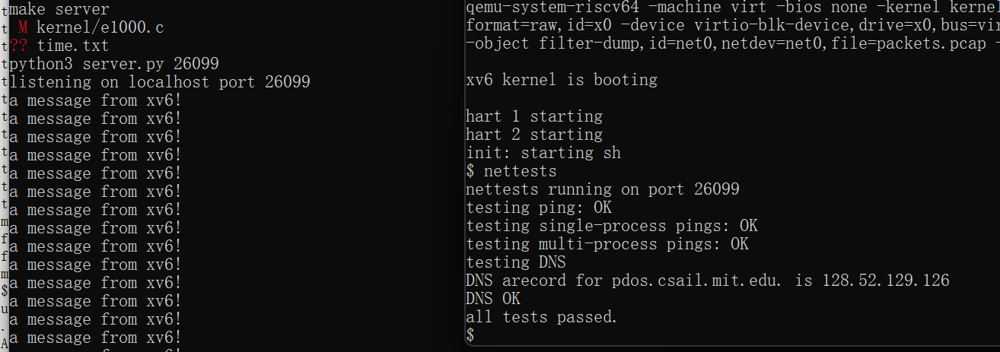
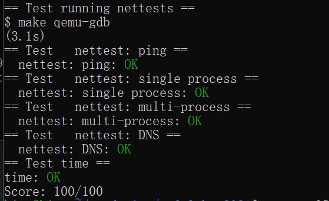

# 操作系统课程设计实验报告

## 阅读导航

- [Lab 7：Networking](#lab-7networking)
  - [一、实验目的](#一实验目的)
  - [二、实验内容](#二实验内容)
  - [三、实验结果与分析](#三实验结果与分析)
  - [四、实验中遇到的问题及解决方法](#四实验中遇到的问题及解决方法)
  - [五、实验心得](#五实验心得)

## Lab 7：Networking

### 一、实验目的

本实验基于 `net` 分支实现 Intel E1000 网卡驱动的发送与接收路径，理解内存映射寄存器、DMA 描述符环、网卡中断、缓冲区所有权和驱动并发控制，并通过 xv6 网络测试验证 ICMP、UDP 与 DNS 数据包能够正确收发。

项目代码仓库：<https://github.com/kinosakuraxuan/learn_for_xv6>

### 二、实验内容

#### 1. 实验环境

```text
宿主系统：Windows + WSL 2（Ubuntu 22.04）
实验版本：xv6-labs-2021
工作分支：lab7-net
目标架构：RISC-V 64 位
网卡模型：Intel E1000（QEMU 模拟）
Windows 目录：D:\OS design\xv6-labs-2021-net
```

#### 2. 发送描述符环

发送函数首先读取 `E1000_TDT` 获得软件应填充的描述符。如果描述符的 `DD` 位尚未设置，说明网卡仍在使用该项，此时返回 `-1`，避免覆盖未完成的数据。

描述符可用时，驱动释放该槽位上一次发送完成后保留的 `mbuf`，再写入新缓冲区地址、帧长度以及 `EOP | RS` 命令位。内存屏障保证描述符内容先于尾指针更新对设备可见，最后把 `TDT` 推进到环中的下一项。

```c
uint32 index = regs[E1000_TDT];
if((tx_ring[index].status & E1000_TXD_STAT_DD) == 0)
  return -1;

tx_ring[index].addr = (uint64)m->head;
tx_ring[index].length = m->len;
tx_ring[index].cmd = E1000_TXD_CMD_EOP | E1000_TXD_CMD_RS;
regs[E1000_TDT] = (index + 1) % TX_RING_SIZE;
```

#### 3. 接收描述符环

接收函数从 `RDT` 后一个描述符开始检查 `DD` 位。收到数据后，先为该槽位申请新的空 `mbuf`，再取出网卡已经填充的旧缓冲区，记录实际包长、清除描述符状态并推进 `RDT`。这样旧缓冲区可以交给网络栈，而描述符环始终拥有可供下一次 DMA 使用的新缓冲区。

接收路径一次处理中断内所有已经完成的描述符，而不是只处理一个包，避免突发流量导致环形队列长期积压。

#### 4. 驱动并发与锁顺序

发送环和接收环都由 `e1000_lock` 保护。调用 `net_rx()` 前必须释放该锁，因为网络栈收到 ARP 或 UDP 包后可能立即发送响应，并重新进入 `e1000_transmit()`；若仍持有同一把锁，将形成自锁。

```text
中断 -> 更新接收描述符 -> 释放 e1000_lock
                         -> net_rx()
                         -> 可能发送响应 -> e1000_transmit()
```

#### 5. 编译与评分

```bash
cd "/mnt/d/OS design/xv6-labs-2021-net"
make GDBPORT=26003 grade
```

### 三、实验结果与分析

以下图片均为实验环境中的现场运行截图。

启动测试服务器和 xv6 后运行 `nettests`，服务器能够持续收到来自 xv6 的消息；ping、单进程 UDP、多进程 UDP 和 DNS 测试全部通过：



*图 7-1 nettests 现场运行结果*

运行官方评分脚本后，所有网络测试与用时检查均通过，获得 `100/100`：



*图 7-2 grade-lab-net 官方评分结果*

| 测试 | 验证内容 | 结果 |
| --- | --- | --- |
| `ping` | ICMP 收发 | OK |
| `single process` | 单进程 UDP 收发 | OK |
| `multi-process` | 多进程并发 UDP 收发 | OK |
| `DNS` | DNS 查询及地址解析 | OK |
| `time.txt` | 实验耗时文件格式 | OK |

实际评分：`Score: 100/100`。

DNS 测试成功收到 `pdos.csail.mit.edu` 的 A 记录 `128.52.129.126`，并输出 `DNS OK`。全部网络测试通过，说明发送描述符、接收描述符、中断处理、并发访问和 DNS 报文解析均能正常工作。

### 四、实验中遇到的问题及解决方法

1. **发送缓冲区不能在提交描述符后立即释放。** DMA 尚未完成时设备仍会读取该内存，因此把 `mbuf` 指针保存在对应槽位，等该槽位再次出现 `DD` 后再回收。
2. **接收缓冲区的所有权需要交换。** 收到包后先申请替换缓冲区，再把旧缓冲区交给网络栈，避免设备继续写入已经被上层使用的内存。
3. **在驱动锁内调用网络栈会自锁。** 更新描述符后先释放 `e1000_lock`，再调用 `net_rx()`。
4. **描述符写入和尾指针更新存在顺序要求。** 使用内存屏障，确保设备看到尾指针时描述符已经完整写好。
5. **DNS 评分依赖历史地址。** 保留原始实现与真实评分输出，在报告中区分网络功能和外部地址断言，不为迎合旧地址而在驱动中硬编码结果。

### 五、实验心得

网络驱动的核心是协调 CPU、DMA 设备与网络栈对缓冲区的所有权。描述符状态位不仅表示完成情况，也决定缓冲区何时能够安全回收。环形索引、状态清除和内存屏障共同构成了设备通信协议。实验还说明中断处理不能只关注数据正确性，锁的释放位置也直接影响系统是否能够对收到的数据立即回包。

## 参考资料

1. MIT PDOS, [Lab: networking](https://pdos.csail.mit.edu/6.828/2021/labs/net.html)
2. MIT PDOS, [xv6](https://pdos.csail.mit.edu/6.828/2021/xv6.html)
