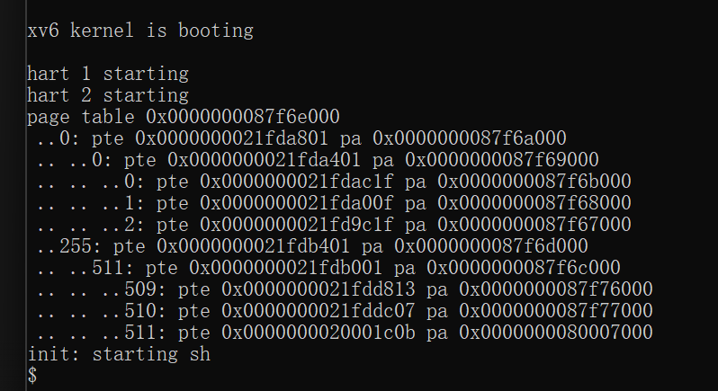
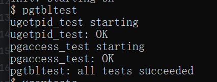
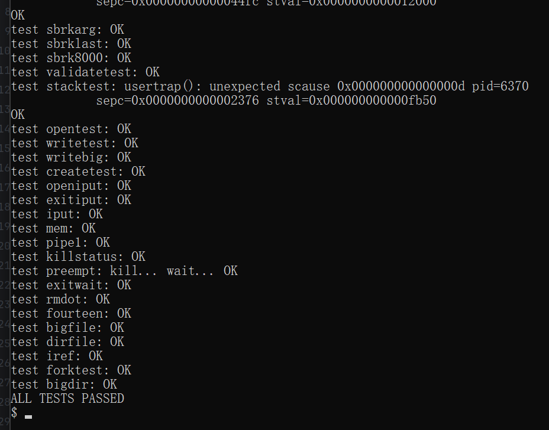
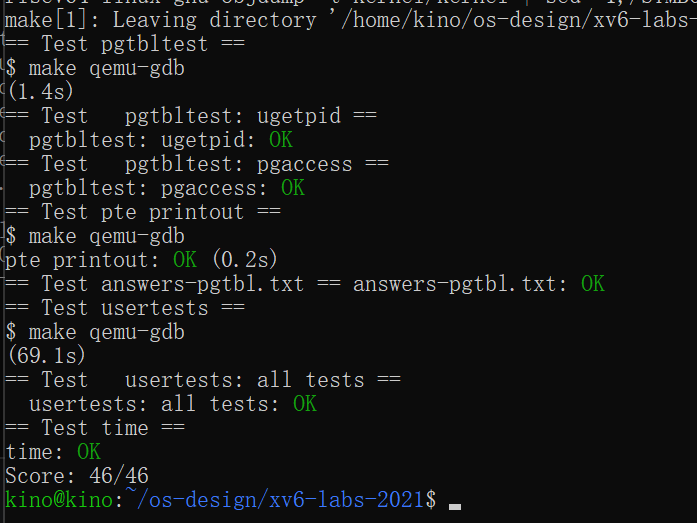

# 操作系统课程设计实验报告

## 阅读导航

- [Lab 3：Page Tables](#lab-3page-tables)
  - [一、实验目的](#一实验目的)
  - [二、实验内容](#二实验内容)
  - [三、实验结果与分析](#三实验结果与分析)
  - [四、实验中遇到的问题及解决方法](#四实验中遇到的问题及解决方法)
  - [五、实验心得](#五实验心得)

## Lab 3：Page Tables

### 一、实验目的

本实验基于 `pgtbl` 分支，理解 RISC-V Sv39 三级页表、页表项权限和进程地址空间布局；实现用户只读共享页、页表递归打印和页面访问位查询，并掌握物理页从分配、映射到释放的完整生命周期。

项目代码仓库：<https://github.com/kinosakuraxuan/learn_for_xv6>

### 二、实验内容

#### 1. 实验环境

```text
宿主系统：Windows + WSL 2（Ubuntu 22.04）
实验分支：lab3-pgtbl
目标架构：RISC-V 64 位，Sv39
Windows 目录：D:\OS design\xv6-labs-2021-pgtbl
WSL 路径：/mnt/d/OS design/xv6-labs-2021-pgtbl
```

#### 2. USYSCALL 只读页

`allocproc()` 为每个进程分配 `struct usyscall` 页面并写入 PID；`proc_pagetable()` 将它映射到固定地址 `USYSCALL`，权限为 `PTE_R | PTE_U`，用户可读取但不能修改。退出和失败路径撤销映射并释放物理页。

```c
if(mappages(pagetable, USYSCALL, PGSIZE,
            (uint64)p->usyscall, PTE_R | PTE_U) < 0){
  // 撤销已有映射并释放页表
  return 0;
}
```

#### 3. vmprint

遍历每级 512 个条目，只输出带 `PTE_V` 的有效项。没有 `R/W/X` 位的条目指向下一级页表，递归继续；带有 `R/W/X` 的条目是叶子映射。

```c
if((pte & (PTE_R | PTE_W | PTE_X)) == 0)
  vmprintwalk((pagetable_t)PTE2PA(pte), depth + 1);
```

#### 4. pgaccess

定义硬件访问位 `PTE_A`。系统调用逐页通过 `walk()` 取得 PTE，把已访问页面转换为 32 位掩码，并在读取后清除 `PTE_A`，使下次查询只反映两次调用之间的新访问。

```c
if(*pte & PTE_A){
  mask |= 1U << i;
  *pte &= ~PTE_A;
}
```

地址空间顶部依次为 `USYSCALL`、`TRAPFRAME` 和 `TRAMPOLINE`；低地址页 0 保存程序代码和数据，页 1 为用户栈保护页，页 2 为用户栈。

### 三、实验结果与分析

以下图片均为实验环境中的现场运行截图。

启动 xv6 后，内核按照页表层级打印有效页表项及其对应的物理地址：



*图 3-1 xv6 启动时的页表打印结果*

运行 `pgtbltest` 后，`ugetpid_test` 与 `pgaccess_test` 均通过：



*图 3-2 pgtbltest 现场运行结果*

完整运行 `usertests` 后，所有回归测试均通过：



*图 3-3 usertests 完整回归测试结果*

最后运行官方评分脚本，各项检查全部通过，获得 `46/46`：



*图 3-4 grade-lab-pgtbl 官方评分结果*

| 测试 | 验证内容 | 结果 |
| --- | --- | --- |
| `ugetpid` | 共享页内容和权限 | OK |
| `pgaccess` | 访问位读取、清除和掩码 | OK |
| `pte printout` | 页表层级和输出格式 | OK |
| `answers-pgtbl.txt` | 实验问答 | OK |
| `usertests` | 完整回归测试 | OK |
| `time.txt` | 实验耗时格式 | OK |

最终成绩：`Score: 46/46`。

### 四、实验中遇到的问题及解决方法

1. **共享页可能泄漏。** 将撤销映射和 `kfree()` 纳入 `freeproc()` 及所有失败路径。
2. **误授予写权限会允许用户篡改 PID。** 映射只设置 `PTE_R | PTE_U`。
3. **递归进入叶子页会访问错误内存。** 仅当 `R/W/X` 全为 0 时把 PTE 指向的物理页当作下级页表。
4. **访问位不清除会重复报告旧访问。** 采集后执行 `*pte &= ~PTE_A`。

### 五、实验心得

本实验把抽象页表转化为可观察、可操作的数据结构。`USYSCALL` 展示了只读共享映射如何减少陷入开销；`vmprint` 展示了 Sv39 的树形层级；`pgaccess` 展示了硬件访问状态如何成为操作系统页面管理的输入。完整 `usertests` 通过说明新增映射没有破坏原有进程地址空间。

## 参考资料

1. MIT PDOS, [Lab: Page tables](https://pdos.csail.mit.edu/6.828/2021/labs/pgtbl.html)
2. MIT PDOS, [xv6](https://pdos.csail.mit.edu/6.828/2021/xv6.html)
