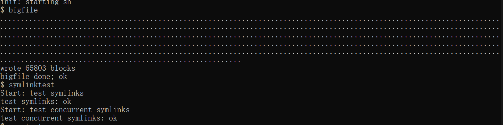
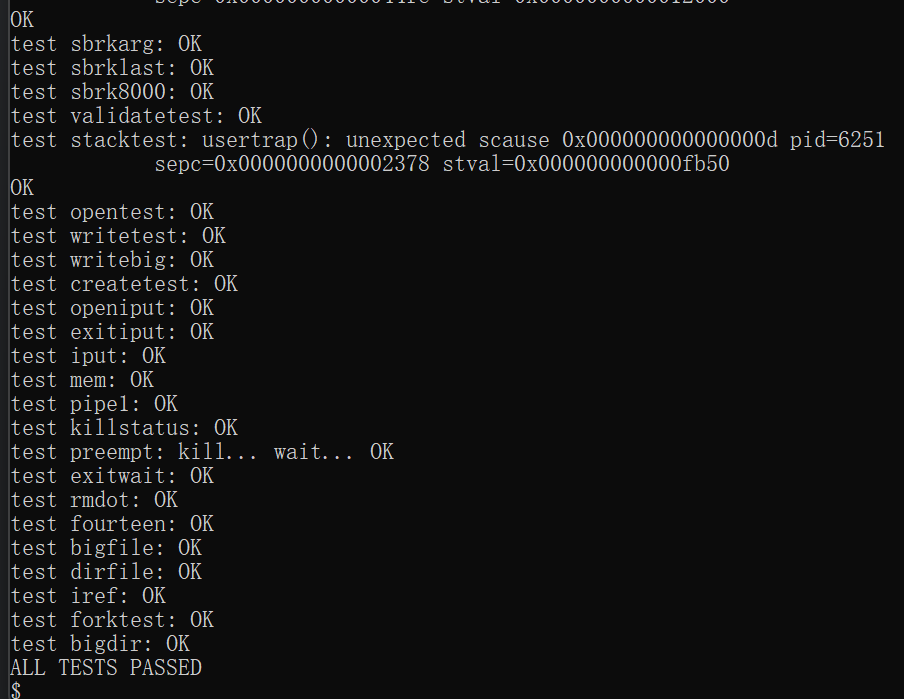
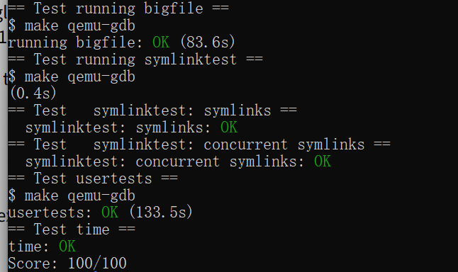

# 操作系统课程设计实验报告

## 阅读导航

- [Lab 9：File System](#lab-9file-system)
  - [一、实验目的](#一实验目的)
  - [二、实验内容](#二实验内容)
  - [三、实验结果与分析](#三实验结果与分析)
  - [四、实验中遇到的问题及解决方法](#四实验中遇到的问题及解决方法)
  - [五、实验心得](#五实验心得)

## Lab 9：File System

### 一、实验目的

本实验基于 `fs` 分支扩展 xv6 文件系统：使用二级间接块支持大文件，实现符号链接系统调用与路径跟随语义。实验用于理解磁盘 inode 的地址布局、逻辑块到磁盘块的映射、截断回收、目录项、系统调用接线和路径解析。

项目代码仓库：<https://github.com/kinosakuraxuan/learn_for_xv6>

### 二、实验内容

#### 1. 实验环境

```text
宿主系统：Windows + WSL 2（Ubuntu 22.04）
实验版本：xv6-labs-2021
工作分支：lab9-fs
目标架构：RISC-V 64 位
块大小：1024 字节
Windows 目录：D:\OS design\xv6-labs-2021-fs
```

#### 2. 二级间接块布局

磁盘 inode 的地址数组总长度保持 13，不改变 inode 大小和磁盘格式尺寸。直接块数量从 12 调整为 11，随后一项保存一级间接块，最后一项保存二级间接块。

```text
addrs[0..10]  -> 11 个直接数据块
addrs[11]     -> 1 个一级间接块 -> 256 个数据块
addrs[12]     -> 1 个二级间接块
                 -> 256 个一级索引块
                 -> 每个再指向 256 个数据块
```

最大数据块数为：

```text
11 + 256 + 256 × 256 = 65803
```

因此 `MAXFILE` 更新为 `NDIRECT + NINDIRECT + NINDIRECT * NINDIRECT`。

#### 3. 扩展 bmap

`bmap()` 依次处理直接、一级间接和二级间接范围。对于二级间接块，逻辑块号除以 `NINDIRECT` 得到第一层索引，取模得到第二层索引。任一级索引块或数据块不存在时使用 `balloc()` 分配，并用 `log_write()` 将索引修改加入日志事务。

```c
uint first = bn / NINDIRECT;
uint second = bn % NINDIRECT;
```

这一映射保证逻辑块连续增长时按需建立索引，不会提前占用 256 个间接块。

#### 4. 扩展 itrunc

删除大文件时，`itrunc()` 必须按相反层次回收所有块：先遍历二级索引中的每个一级索引块并释放其数据块，再释放一级索引块，最后释放二级根索引块。每个地址清零后调用 `iupdate()`，避免 inode 保留悬空磁盘块号。

#### 5. 符号链接

实验增加以下接口与常量：

```text
T_SYMLINK：符号链接 inode 类型
SYS_symlink：系统调用号
symlink(target, path)：用户接口
O_NOFOLLOW：打开链接本身而不是目标
```

`sys_symlink()` 使用 `create()` 新建 `T_SYMLINK` inode，并把目标路径连同字符串结束符写入其数据区。目标可以暂时不存在，因为创建链接时不解析目标。

`sys_open()` 默认读取符号链接保存的目标并再次调用 `namei()`。最多跟随 10 层，超过限制或目标不存在时返回失败，从而处理循环链接。指定 `O_NOFOLLOW` 时保留链接 inode，可通过 `fstat()` 观察其类型。

#### 6. 编译与评分

Windows 挂载盘上的 QEMU 虚拟磁盘写入非常慢，因此成果仍保存在 Windows 目录，但评分时复制到独立的 WSL 临时目录运行：

```bash
cd /tmp/xv6-fs-test-codex-20260826
make GDBPORT=26005 grade
```

该临时目录不属于现有 WSL Git 仓库，只用于提高测试速度。

### 三、实验结果与分析

以下图片均为实验环境中的现场运行截图。

在 xv6 中运行 `bigfile` 与 `symlinktest`，成功写入 65,803 个块，普通符号链接与并发符号链接测试均通过：



*图 9-1 bigfile 与 symlinktest 现场运行结果*

随后运行完整 `usertests`，所有文件系统及进程回归测试均通过：



*图 9-2 usertests 完整回归测试结果*

最后运行官方评分脚本，`bigfile`、`symlinktest`、`usertests` 与用时检查全部通过，获得 `100/100`：



*图 9-3 grade-lab-fs 官方评分结果*

| 测试 | 验证内容 | 结果 |
| --- | --- | --- |
| `bigfile` | 写入并读回 65,803 个块 | OK |
| `symlinks` | 创建、跟随、断链、链式链接与循环检测 | OK |
| `concurrent symlinks` | 并发创建、查询和删除链接 | OK |
| `usertests` | xv6 完整回归 | OK |
| `time.txt` | 实验耗时文件格式 | OK |

最终成绩：`Score: 100/100`。

`bigfile` 在 WSL 原生临时目录中 87.4 秒完成，正确写入并校验 65,803 个块。符号链接两项和完整回归全部通过，说明新 inode 布局与 `mkfs` 一致，块映射、块回收以及路径跟随均未破坏原文件系统功能。

### 四、实验中遇到的问题及解决方法

1. **不能直接扩大 inode 地址数组。** 磁盘 inode 大小会影响每块 inode 数量和文件系统布局，因此保持 13 项不变，用 11 个直接块换取一个二级间接入口。
2. **二级索引需要两次按需分配。** 先确保二级根块存在，再确保对应一级索引块存在，最后分配数据块；每次修改索引都写入日志。
3. **截断只释放数据块会泄漏索引块。** 按“数据块—一级索引块—二级根块”的顺序逐层回收。
4. **符号链接循环可能让 `open()` 永不返回。** 设置最多 10 层的跟随上限，超过后释放当前 inode 并返回失败。
5. **Windows 挂载盘导致大文件测试超时。** 不改变成果位置，只复制临时测试副本到 WSL 原生文件系统；同一代码随后通过官方测试。

### 五、实验心得

inode 中少量地址项通过间接索引形成了巨大的文件容量。二级间接块以一次额外查表为代价，把可寻址范围从数百块扩展到六万多块。符号链接则说明“文件名”和“文件内容”可以共同参与路径解析：链接本身是一个 inode，其内容保存下一次解析所需的路径。两项任务都要求同时考虑创建、访问和回收的完整生命周期。

## 参考资料

1. MIT PDOS, [Lab: file system](https://pdos.csail.mit.edu/6.828/2021/labs/fs.html)
2. MIT PDOS, [xv6](https://pdos.csail.mit.edu/6.828/2021/xv6.html)
