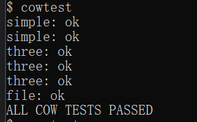
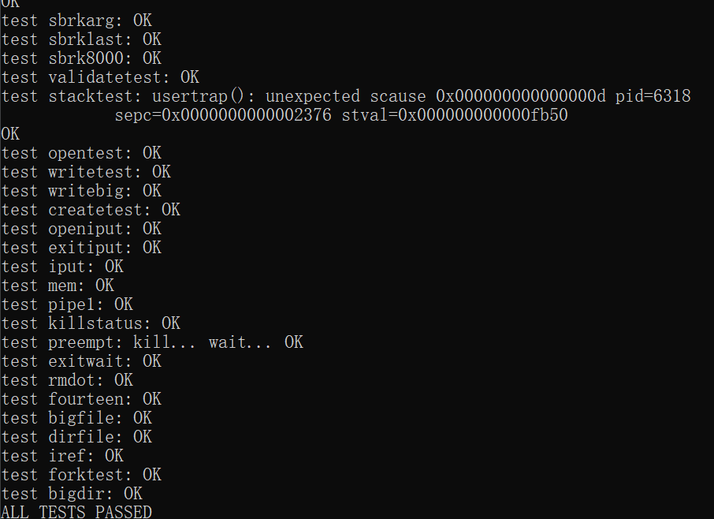
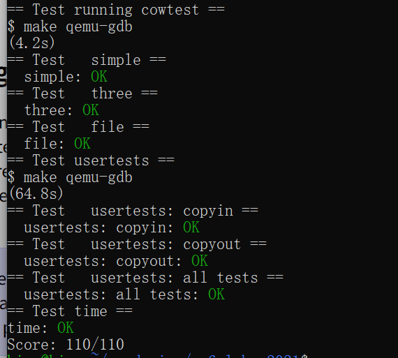

# 操作系统课程设计实验报告

## 阅读导航

- [Lab 5：Copy-on-Write Fork](#lab-5copy-on-write-fork)
  - [一、实验目的](#一实验目的)
  - [二、实验内容](#二实验内容)
  - [三、实验结果与分析](#三实验结果与分析)
  - [四、实验中遇到的问题及解决方法](#四实验中遇到的问题及解决方法)
  - [五、实验心得](#五实验心得)

## Lab 5：Copy-on-Write Fork

### 一、实验目的

本实验基于 MIT `xv6-labs-2021` 的 `cow` 分支实现写时复制 `fork()`。目标是理解页表提供的地址转换与权限保护机制，掌握使用软件保留位标记 COW 页面、处理写缺页异常、维护物理页引用计数，以及让内核 `copyout()` 正确写入 COW 页面的方法。

项目代码仓库：<https://github.com/kinosakuraxuan/learn_for_xv6>

### 二、实验内容

#### 1. 实验环境

```text
宿主系统：Windows + WSL 2（Ubuntu 22.04）
实验版本：xv6-labs-2021
工作分支：lab5-cow
目标架构：RISC-V 64 位
Windows 目录：D:\OS design\xv6-labs-2021-cow
WSL 路径：/mnt/d/OS design/xv6-labs-2021-cow
```

#### 2. 在 fork 中共享物理页

原始 `uvmcopy()` 会为子进程逐页分配内存并复制数据。本实验改为让父子页表指向同一物理页。对于原来可写的页面，同时清除父子 PTE 的 `PTE_W`，并设置软件位 `PTE_COW`；原本只读的代码页保持只读共享，不标记为 COW。

```c
if(flags & PTE_W){
  flags = (flags & ~PTE_W) | PTE_COW;
  *pte = PA2PTE(pa) | flags;
}
if(mappages(new, i, PGSIZE, pa, flags) != 0)
  goto err;
krefinc(pa);
```

这样 `fork()` 只创建页表映射，不立即复制用户内存。若子进程马上执行 `exec()`，共享页会直接释放，不产生无用复制。

#### 3. 物理页引用计数

一个物理页可能被多个进程页表引用，因此不能在任一进程退出时立即放回空闲链表。分配器为 `KERNBASE` 到 `PHYSTOP` 范围内的每个物理页维护引用计数：

1. `kalloc()` 取出页面时把计数设为 1；
2. `fork()` 建立共享映射后递增计数；
3. `kfree()` 先递减计数，只有计数归零才填充垃圾值并加入空闲链表；
4. 所有计数操作与空闲链表共用 `kmem.lock` 保护。

#### 4. 处理 COW 写缺页

用户写入只读 COW 页面时，RISC-V 产生 store page fault，`scause` 为 15。`usertrap()` 调用 `cowalloc()`：先校验 PTE 的 `PTE_V`、`PTE_U` 和 `PTE_COW`，再决定是否复制。

```c
if(krefcount(pa) == 1){
  *pte = PA2PTE(pa) | ((flags | PTE_W) & ~PTE_COW);
  sfence_vma();
  return 0;
}

mem = kalloc();
memmove(mem, (char*)pa, PGSIZE);
*pte = PA2PTE((uint64)mem) | ((flags | PTE_W) & ~PTE_COW);
kfree((void*)pa);
```

若物理页只剩一个引用，无需复制，直接恢复写权限；若仍被多个页表共享，则分配新页、复制内容、替换 PTE，并递减旧页引用计数。内存不足或非法故障会终止进程。

#### 5. 兼容 copyout

`copyout()` 在内核态直接向用户物理页写数据，不会触发用户态写缺页，因此在取得物理地址前主动检查 `PTE_COW` 并调用同一个 `cowalloc()`。同时在调用 `walk()` 前检查 `MAXVA`，非法用户地址直接返回 `-1`，避免内核 panic。

#### 6. 编译与测试

```bash
cd "/mnt/d/OS design/xv6-labs-2021-cow"
make GDBPORT=26001 grade
```

使用独立 GDB 端口是为了避免影响 WSL 主仓库中已运行的 QEMU。

### 三、实验结果与分析

以下图片均为实验环境中的现场运行截图。

在 xv6 中运行 `cowtest`，`simple`、`three` 和 `file` 测试全部通过：



*图 5-1 cowtest 现场运行结果*

随后运行完整 `usertests`，全部回归测试通过：



*图 5-2 usertests 完整回归测试结果*

最后运行官方评分脚本，`cowtest`、`usertests` 与用时检查均通过，获得 `110/110`：



*图 5-3 grade-lab-cow 官方评分结果*

| 测试 | 验证内容 | 结果 |
| --- | --- | --- |
| `simple` | 大地址空间 fork 不立即复制 | OK |
| `three` | 多进程共享、写入和退出 | OK |
| `file` | 内核 copyout 写入 COW 页面 | OK |
| `usertests: copyin` | 用户内存读取边界 | OK |
| `usertests: copyout` | 用户内存写入与非法地址 | OK |
| `usertests: all tests` | 完整内核回归测试 | OK |
| `time.txt` | 实验耗时文件格式 | OK |

最终成绩：`Score: 110/110`。

测试表明父子进程能够共享物理内存，任一方写入时会获得独立副本；物理页在最后一个引用消失前不会被错误释放。完整 `usertests` 通过说明 COW 改动没有破坏 `exec()`、进程退出和用户地址检查等原有路径。

### 四、实验中遇到的问题及解决方法

1. **共享物理页被提前释放。** 为每个可分配物理页增加引用计数，`kfree()` 只在计数归零时回收。
2. **只读代码页不能变成可写页。** 只有原 PTE 带 `PTE_W` 时才设置 `PTE_COW`；原生只读页保持只读，写入仍属于非法访问。
3. **内核写用户内存不会产生用户缺页异常。** 在 `copyout()` 中主动调用与 page fault 相同的 COW 解析函数。
4. **非法地址导致 `walk()` panic。** 在 COW 检查前先判断 `va0 >= MAXVA`，越界地址直接返回错误。
5. **页表权限更新后可能继续使用旧 TLB 项。** 修改 PTE 后调用 `sfence_vma()` 刷新地址转换缓存。

### 五、实验心得

COW 的核心不是简单地“延迟复制”，而是让页表权限、缺页异常和物理页生命周期共同构成一个正确协议。只读映射负责拦截写入，软件位区分合法 COW 与真正只读页面，引用计数保证共享页安全释放，故障处理再按需建立私有副本。这个实验体现了虚拟内存间接层在性能优化中的价值，也说明优化必须覆盖用户写入、内核写入和错误路径才能保持系统正确。

## 参考资料

1. MIT PDOS, [Lab: Copy-on-Write Fork for xv6](https://pdos.csail.mit.edu/6.828/2021/labs/cow.html)
2. MIT PDOS, [xv6](https://pdos.csail.mit.edu/6.828/2021/xv6.html)
