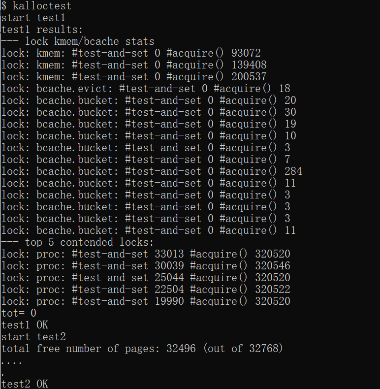
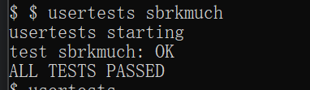
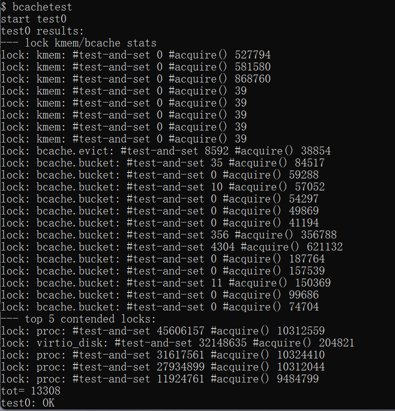
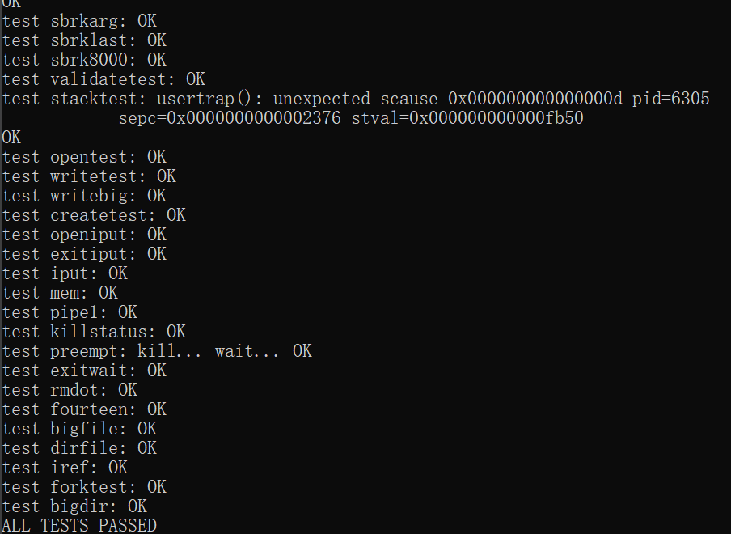
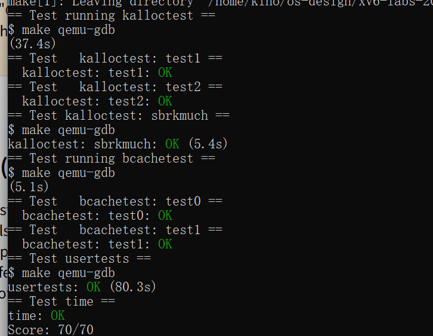

# 操作系统课程设计实验报告

## 阅读导航

- [Lab 8：Locks](#lab-8locks)
  - [一、实验目的](#一实验目的)
  - [二、实验内容](#二实验内容)
  - [三、实验结果与分析](#三实验结果与分析)
  - [四、实验中遇到的问题及解决方法](#四实验中遇到的问题及解决方法)
  - [五、实验心得](#五实验心得)

## Lab 8：Locks

### 一、实验目的

本实验基于 `lock` 分支降低 xv6 内存分配器和磁盘缓冲区缓存的锁竞争。实验要求在保持数据结构正确、磁盘块缓存唯一和完整回归通过的前提下，提高多核并发访问能力，理解锁粒度、局部资源、工作窃取和双重检查。

项目代码仓库：<https://github.com/kinosakuraxuan/learn_for_xv6>

### 二、实验内容

#### 1. 实验环境

```text
宿主系统：Windows + WSL 2（Ubuntu 22.04）
实验版本：xv6-labs-2021
工作分支：lab8-lock
目标架构：RISC-V 64 位
CPU 数量：3（评分配置）
Windows 目录：D:\OS design\xv6-labs-2021-lock
```

#### 2. 每 CPU 物理页空闲链表

原分配器只有一个 `kmem.lock` 和一条空闲链表，所有 CPU 的 `kalloc()` 与 `kfree()` 都在同一锁上竞争。实验将其改为 `NCPU` 组独立链表和锁：释放页进入当前 CPU 的链表，申请页优先从当前 CPU 取出。

读取 `cpuid()` 前使用 `push_off()` 关闭中断，防止进程在确定 CPU 编号的过程中被迁移。若本地链表为空，则逐个检查其他 CPU，并一次借取最多 64 页；第一页面向当前申请，其余页面补入本地链表，从而减少连续跨 CPU 加锁。

```text
CPU 0 -> kmem[0] freelist
CPU 1 -> kmem[1] freelist
CPU 2 -> kmem[2] freelist
本地为空 -> 从其他 CPU 批量借页
```

#### 3. 哈希化磁盘缓冲区缓存

原 `bcache` 使用一把全局锁保护所有缓冲区和 LRU 链表。实验按块号对 13 取模，把缓冲区分入 13 个桶，每个桶拥有独立自旋锁和局部双向链表。缓存命中、`brelse()`、`bpin()` 与 `bunpin()` 只访问对应桶。

缓存未命中时，驱动获取低频使用的 `evictlock`，再次检查目标桶，随后从各桶寻找引用计数为 0 的缓冲区并移动到目标桶。第二次检查可防止两个 CPU 在等待期间分别为同一磁盘块创建缓存副本，替换锁保证“检查—选择—安装”过程对其他未命中操作是原子的。

#### 4. 正确性与并行性

缓冲区的睡眠锁仍保护块内容，桶锁只保护块号、引用计数和链表关系。这样不同磁盘块可并行查找，同一磁盘块仍只存在一个缓存副本。页面分配器同样把常用路径限制在当前 CPU，只有局部资源耗尽时才发生跨 CPU 协调。

#### 5. 编译与评分

```bash
cd "/mnt/d/OS design/xv6-labs-2021-lock"
make GDBPORT=26004 grade
```

### 三、实验结果与分析

以下图片均为实验环境中的现场运行截图。

运行 `kalloctest` 后，低锁竞争测试与空闲页数量检查均通过：



*图 8-1 kalloctest 现场运行结果*

运行 `usertests sbrkmuch`，大规模用户内存扩展测试通过：



*图 8-2 usertests sbrkmuch 运行结果*

运行 `bcachetest` 后，可以观察缓冲区缓存锁统计，`test0` 检查通过：



*图 8-3 bcachetest 现场运行结果*

随后运行完整 `usertests`，所有回归测试均通过：



*图 8-4 usertests 完整回归测试结果*

最后运行官方评分脚本，`kalloctest`、`bcachetest`、`usertests` 与用时检查均通过，获得 `70/70`：



*图 8-5 grade-lab-lock 官方评分结果*

| 测试 | 验证内容 | 结果 |
| --- | --- | --- |
| `kalloctest test1` | 多核页分配锁竞争 | OK |
| `kalloctest test2` | 可分配页数量与重复回收 | OK |
| `sbrkmuch` | 大量用户内存扩展 | OK |
| `bcachetest test0` | 缓冲区锁竞争低于阈值 | OK |
| `bcachetest test1` | 不同文件并发读与缓存替换 | OK |
| `usertests` | xv6 完整回归 | OK |
| `time.txt` | 实验耗时文件格式 | OK |

最终成绩：`Score: 70/70`。

专项测试和完整回归均通过，说明每 CPU 页链表没有丢失或重复释放页面，哈希缓冲区缓存同时满足低竞争与单副本不变量。

### 四、实验中遇到的问题及解决方法

1. **只拆分链表会造成局部耗尽。** 增加跨 CPU 借页路径，在保持局部快速路径的同时允许所有 CPU 使用系统剩余内存。
2. **每次只借一页会放大跨 CPU 锁开销。** 改为批量借取最多 64 页，后续分配可直接命中本地链表。
3. **哈希桶可能产生同一块的两个副本。** 未命中后使用替换锁并进行第二次查找，确认仍不存在目标块后才安装新缓存。
4. **替换时需要同时修改两个桶。** 所有跨桶移动都由替换锁串行化，普通操作只持有一个桶锁，从而避免交叉等待。
5. **专项测试通过后完整回归仍需验证。** 继续运行 `usertests`，确认文件创建、链接、并发读写和进程内存操作没有受到优化影响。

### 五、实验心得

降低锁竞争并不是简单地增加锁的数量，而是先识别共享数据中可以局部化的部分。物理页可按 CPU 保存，磁盘块可按块号哈希；只有资源再平衡和缓存替换需要全局协调。实验展示了常见的并发设计原则：快速路径局部化，慢速路径负责恢复全局平衡，同时用第二次检查维护唯一性不变量。

## 参考资料

1. MIT PDOS, [Lab: locks](https://pdos.csail.mit.edu/6.828/2021/labs/lock.html)
2. MIT PDOS, [xv6](https://pdos.csail.mit.edu/6.828/2021/xv6.html)
