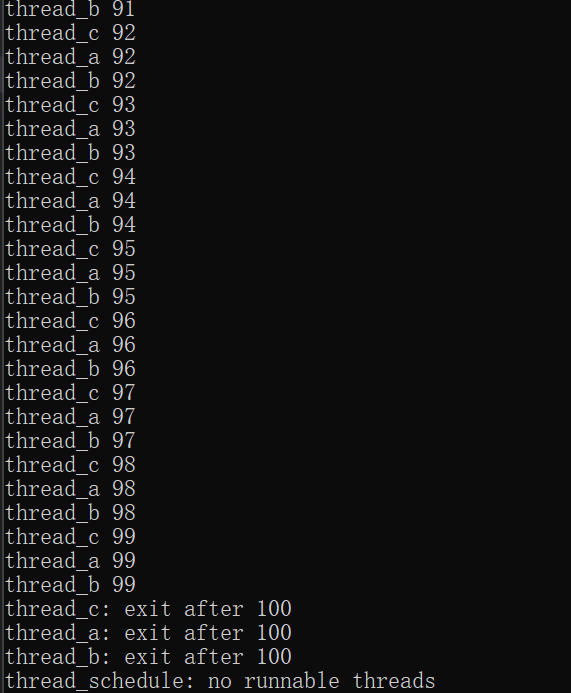
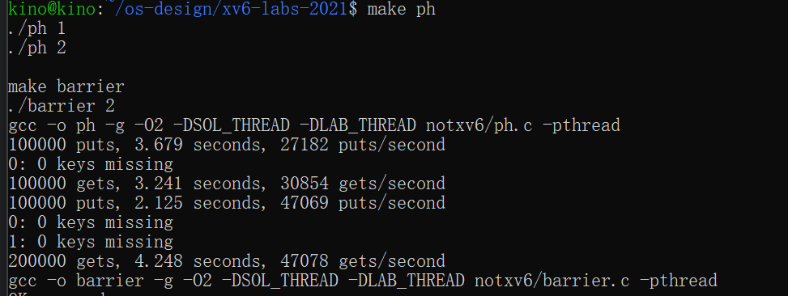
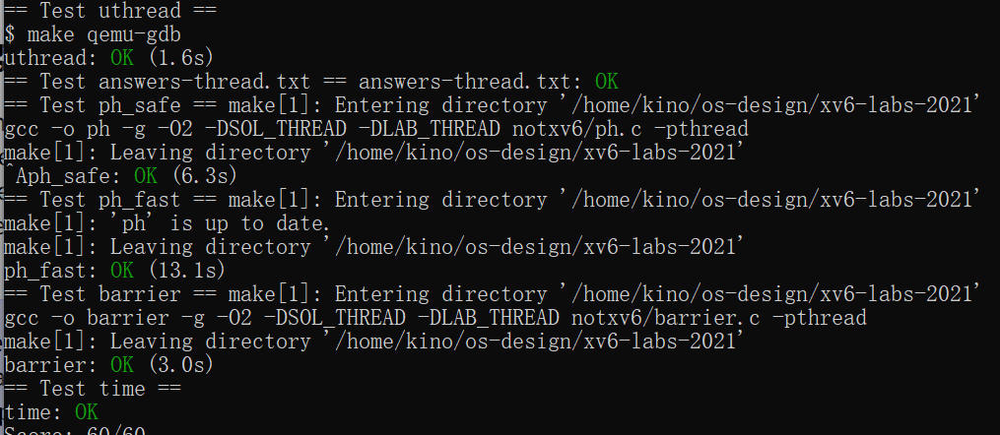

# 操作系统课程设计实验报告

## 阅读导航

- [Lab 6：Multithreading](#lab-6multithreading)
  - [一、实验目的](#一实验目的)
  - [二、实验内容](#二实验内容)
  - [三、实验结果与分析](#三实验结果与分析)
  - [四、实验中遇到的问题及解决方法](#四实验中遇到的问题及解决方法)
  - [五、实验心得](#五实验心得)

## Lab 6：Multithreading

### 一、实验目的

本实验基于 `thread` 分支完成三个多线程主题：在 xv6 用户空间实现协作式线程上下文切换；使用 pthread 互斥锁修复并发哈希表的数据竞争并保留并行性；使用互斥锁和条件变量实现可重复使用的多轮屏障。实验用于理解上下文、调用约定、竞态条件、锁粒度和条件同步。

项目代码仓库：<https://github.com/kinosakuraxuan/learn_for_xv6>

### 二、实验内容

#### 1. 实验环境

```text
宿主系统：Windows + WSL 2（Ubuntu 22.04）
实验版本：xv6-labs-2021
工作分支：lab6-thread
目标架构：RISC-V 64 位
线程库：POSIX pthread
Windows 目录：D:\OS design\xv6-labs-2021-thread
```

#### 2. 用户级线程上下文

每个线程拥有 8192 字节独立栈、运行状态和一个上下文结构。RISC-V 调用约定规定被调用者保存 `ra`、`sp` 和 `s0`～`s11`，因此线程切换只需保存这些寄存器；调用者保存寄存器已经由执行 `thread_switch()` 的 C 代码负责。

创建新线程时，把上下文的 `ra` 设置为入口函数，把 `sp` 设置到线程栈顶：

```c
memset(&t->context, 0, sizeof(t->context));
t->context.ra = (uint64)func;
t->context.sp = (uint64)t->stack + STACK_SIZE;
t->state = RUNNABLE;
```

调度器选出下一个 `RUNNABLE` 线程后调用汇编函数。汇编依次把旧线程的 callee-saved 寄存器写入旧上下文，再从新上下文恢复寄存器。最后执行 `ret`，首次运行会跳到线程入口，后续运行则返回到上次离开的位置。



*图 1：`uthread` 中三个用户级线程交替调度，均运行至 100 后正常退出。*

#### 3. 并发哈希表

原程序中两个线程可能同时读取相同桶头，各自创建节点后先后写回 `table[i]`，后一次写入会覆盖前一次写入，使节点丢失。实验为五个哈希桶分别配置一个 `pthread_mutex_t`：

```c
int i = key % NBUCKET;
pthread_mutex_lock(&bucket_locks[i]);
// 查找、更新或插入节点
pthread_mutex_unlock(&bucket_locks[i]);
```

同一桶内的复合操作被串行化，不同桶的 `put()` 仍可并行执行。相比单一全局锁，桶级锁既消除丢失键，又满足两线程吞吐量至少为单线程 1.25 倍的要求。`get()` 使用相同桶锁保证遍历一致。

#### 4. 多轮 barrier

每个线程进入屏障后，在互斥锁保护下增加 `bstate.nthread`。最后到达的线程把计数清零、增加轮次并广播条件变量；其他线程使用 `while` 循环等待轮次变化。

```c
int this_round = bstate.round;
bstate.nthread++;
if(bstate.nthread == nthread){
  bstate.nthread = 0;
  bstate.round++;
  pthread_cond_broadcast(&bstate.barrier_cond);
} else {
  while(this_round == bstate.round)
    pthread_cond_wait(&bstate.barrier_cond, &bstate.barrier_mutex);
}
```

轮次变量既支持连续 20000 次复用，也防止快速线程在上一轮尚未完全结束时混入下一轮计数。`while` 而不是 `if` 还能正确处理条件变量的虚假唤醒。



*图 2：`ph` 单线程/双线程性能与正确性测试，以及 `barrier` 的编译运行过程。*

#### 5. 编译与评分

```bash
cd "/mnt/d/OS design/xv6-labs-2021-thread"
make GDBPORT=26002 grade
```

`uthread` 在 QEMU 内运行；`ph` 和 `barrier` 使用 WSL 的多核 Linux 与 pthread 直接运行。

### 三、实验结果与分析

| 测试 | 验证内容 | 结果 |
| --- | --- | --- |
| `uthread` | 三个用户级线程创建、切换和退出 | OK |
| `answers-thread.txt` | 并发丢失键时序分析 | OK |
| `ph_safe` | 两线程运行时丢失键数量为 0 | OK |
| `ph_fast` | 两线程插入速度达到要求 | OK |
| `barrier` | 20000 轮条件同步 | OK |
| `time.txt` | 实验耗时文件格式 | OK |



*图 3：官方评分脚本中 `uthread`、`answers-thread.txt`、`ph_safe`、`ph_fast`、`barrier` 和 `time.txt` 全部通过。*

最终成绩：`Score: 60/60`。

结果说明上下文布局与汇编偏移一致，线程首次启动和再次调度都能恢复到正确执行位置；桶级锁同时满足正确性和并行加速要求；屏障能够处理连续轮次，没有线程提前越过同步点。

### 四、实验中遇到的问题及解决方法

1. **新线程没有有效返回地址和栈。** 在线程创建时把 `ra` 初始化为入口函数，并把 `sp` 指向独立栈顶。
2. **上下文结构与汇编偏移可能不一致。** 按 `ra`、`sp`、`s0`～`s11` 的固定顺序定义结构，并让每个汇编偏移增加 8 字节。
3. **全局锁会消除并行加速。** 使用每桶一锁，让访问不同桶的插入并行进行。
4. **屏障计数会被下一轮提前复用。** 最后到达者在同一临界区内清零计数并递增 `round`，等待者只在轮次改变后退出。
5. **条件变量可能虚假唤醒。** 使用 `while(this_round == bstate.round)` 重新检查谓词。

### 五、实验心得

线程切换本质上是保存“未来继续执行所需的最小状态”。用户级线程依赖 ABI 约定保存 callee-saved 寄存器，而同步正确性则依赖对共享状态更新范围的准确识别。哈希表实验说明锁粒度直接决定并发性能；屏障实验说明条件变量必须和受锁保护的状态谓词一起使用。三个任务共同展示了并发程序中正确性、进度和性能之间的关系。

## 参考资料

1. MIT PDOS, [Lab: Multithreading](https://pdos.csail.mit.edu/6.828/2021/labs/thread.html)
2. MIT PDOS, [xv6](https://pdos.csail.mit.edu/6.828/2021/xv6.html)
