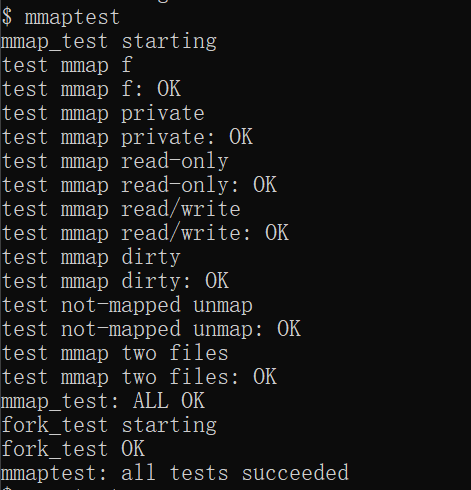
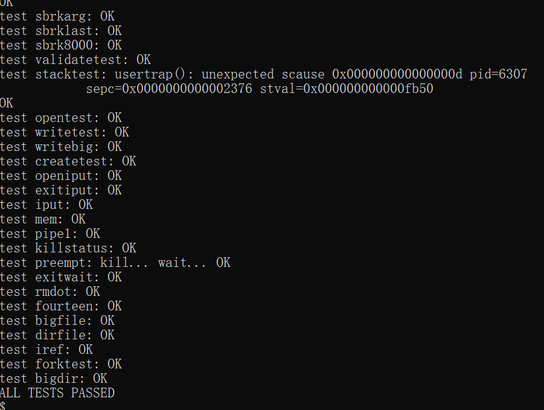
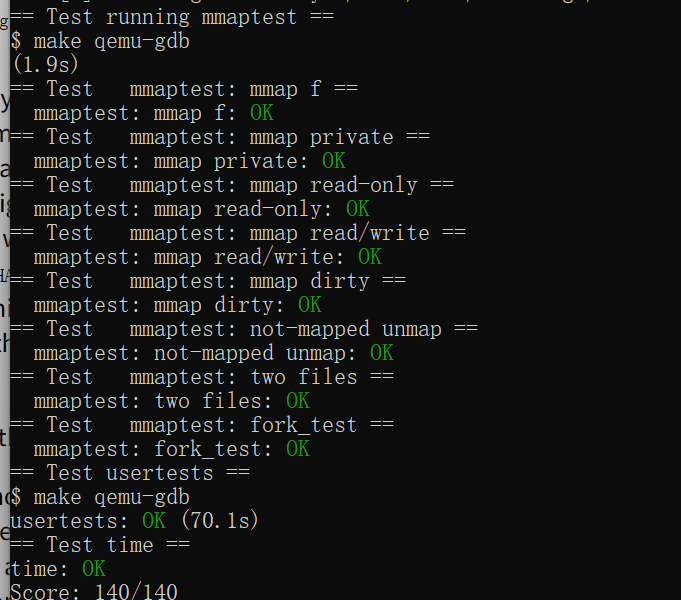

# 操作系统课程设计实验报告

## 阅读导航

- [Lab 10：mmap](#lab-10mmap)
  - [一、实验目的](#一实验目的)
  - [二、实验内容](#二实验内容)
  - [三、实验结果与分析](#三实验结果与分析)
  - [四、实验中遇到的问题及解决方法](#四实验中遇到的问题及解决方法)
  - [五、实验心得](#五实验心得)

## Lab 10：mmap

### 一、实验目的

本实验基于 `mmap` 分支为 xv6 实现文件映射系统调用。主要目标是理解虚拟内存区域、懒分配页故障、文件内容装页、页表权限、共享映射回写，以及映射在 `fork`、`exit` 和 `exec` 中的生命周期管理。

项目代码仓库：<https://github.com/kinosakuraxuan/learn_for_xv6>

### 二、实验内容

#### 1. 实验环境

```text
宿主系统：Windows + WSL 2（Ubuntu 22.04）
实验版本：xv6-labs-2021
工作分支：lab10-mmap
目标架构：RISC-V 64 位
页大小：4096 字节
Windows 目录：D:\OS design\xv6-labs-2021-mmap
```

#### 2. VMA 数据结构

每个进程保存 16 个虚拟内存区域。每个 VMA 记录起始虚拟地址、页对齐长度、保护权限、映射类型、文件指针和文件偏移。映射地址从独立的高地址区域 `MMAPBASE` 向上分配，不修改 `p->sz`，避免与程序堆、栈和普通 `uvmcopy()` 范围混合。

```c
struct vma {
  int used;
  uint64 addr;
  uint64 length;
  int prot;
  int flags;
  struct file *file;
  uint offset;
};
```

#### 3. mmap 系统调用

`sys_mmap()` 校验长度、页对齐偏移、映射类型和文件权限。共享可写映射要求文件本身以可写方式打开；私有可写映射可以基于只读文件，因为修改不会回写。成功后只创建 VMA 并增加文件引用，不立即申请物理页。

这种懒分配方式使映射成本与实际访问的页数相关，未访问的页不占用物理内存，也不读取磁盘。

#### 4. 页故障装入

用户访问尚未装入的映射页时产生页故障。处理函数查找覆盖故障地址的 VMA，并核对读、写或执行权限；随后申请并清零一个物理页，从文件的对应偏移读取最多一页内容，再根据 `PROT_READ`、`PROT_WRITE` 和 `PROT_EXEC` 建立用户页表映射。

```text
故障虚拟地址
  -> 查找 VMA
  -> 检查访问权限
  -> kalloc + 清零
  -> readi 读取文件页
  -> mappages 建立 PTE
  -> 返回用户态重试指令
```

文件末尾不足一页的剩余部分保持为零，符合测试对 1.5 页文件映射为 2 页时的要求。

#### 5. munmap 与共享回写

`vmaunmap()` 支持解除整个 VMA、前缀或后缀。对尚未发生页故障的页直接跳过；对已经映射的页，`MAP_SHARED | PROT_WRITE` 在释放前通过 `writei()` 回写文件，`MAP_PRIVATE` 只释放物理页而不修改文件。

解除前缀时同时推进 VMA 起始地址和文件偏移；解除后缀时缩短长度；整个区域解除后关闭映射持有的文件引用并清空 VMA。

#### 6. 进程生命周期

`fork()` 复制父进程的 VMA 元数据并对每个文件执行 `filedup()`。映射页本身仍由子进程首次访问时懒加载，因此父子页表中的物理页相互独立，但两者都能根据同一文件和偏移获得数据。

`exit()` 和成功的 `exec()` 会逐个解除剩余 VMA，完成共享数据回写、物理页释放和文件引用关闭，防止页表叶节点或文件引用泄漏。

#### 7. 编译与评分

```bash
cd /tmp/xv6-mmap-test-codex-20260826
make GDBPORT=26006 grade
```

评分使用从 Windows 成果目录复制的 WSL 临时测试副本，不修改现有 WSL Git 仓库。

### 三、实验结果与分析

以下图片均为实验环境中的现场运行截图。

在 xv6 中运行 `mmaptest`，文件映射、私有映射、只读与读写权限、脏页回写、未装页区间解除、双文件映射及 `fork` 继承测试全部通过：



*图 10-1 mmaptest 现场运行结果*

随后运行完整 `usertests`，所有回归测试均通过：



*图 10-2 usertests 完整回归测试结果*

最后运行官方评分脚本，`mmaptest`、`usertests` 与用时检查全部通过，获得 `140/140`：



*图 10-3 grade-lab-mmap 官方评分结果*

| 测试 | 验证内容 | 结果 |
| --- | --- | --- |
| `mmap f` | 只读文件映射与内容校验 | OK |
| `mmap private` | 私有可写映射不回写 | OK |
| `mmap read-only` | 拒绝只读文件的共享可写映射 | OK |
| `mmap read/write` | 共享读写映射与部分解除 | OK |
| `mmap dirty` | 修改内容回写文件 | OK |
| `not-mapped unmap` | 解除从未装页的区间 | OK |
| `two files` | 同一进程同时映射多个文件 | OK |
| `fork_test` | 子进程继承映射 | OK |
| `usertests` | xv6 完整回归 | OK |
| `time.txt` | 实验耗时文件格式 | OK |

最终成绩：`Score: 140/140`。

所有映射语义和完整回归均通过，说明 VMA 查找、懒装页、权限设置、部分解除、共享回写、文件引用计数和进程生命周期处理正确。

### 四、实验中遇到的问题及解决方法

1. **把映射直接加入 `p->sz` 会影响原页表复制。** 使用独立高地址映射区，使普通堆内存仍由 `uvmcopy()` 和 `uvmfree()` 管理，VMA 页单独管理。
2. **映射建立时不能立即读取全部文件。** 仅登记 VMA，在页故障时分配并读入实际访问页，实现懒加载。
3. **解除映射可能遇到未装页。** 先检查页表项是否有效，只对已映射页调用 `uvmunmap()`，避免触发“not mapped”内核异常。
4. **部分解除后文件偏移容易错误。** 解除前缀时同时增加 `addr` 和 `offset`，使新起点仍对应正确文件位置。
5. **关闭原文件描述符后映射仍需有效。** 建立映射时使用 `filedup()` 持有独立引用，直到整个 VMA 被解除。
6. **进程退出可能遗留高地址叶页表项。** 在释放普通页表前遍历 VMA 完成解除；`exec()` 成功替换地址空间时执行同样清理。

### 五、实验心得

`mmap` 把文件系统与虚拟内存连接在同一抽象中。系统调用本身只描述地址区间和文件关系，真正的数据搬运推迟到页故障发生时完成。正确实现不仅要处理第一次访问，还必须覆盖部分解除、共享回写、文件提前关闭、进程复制和进程结束。实验体现了操作系统资源管理的共同特点：创建接口往往很短，复杂性主要集中在权限验证和完整生命周期清理。

## 参考资料

1. MIT PDOS, [Lab: mmap](https://pdos.csail.mit.edu/6.828/2021/labs/mmap.html)
2. MIT PDOS, [xv6](https://pdos.csail.mit.edu/6.828/2021/xv6.html)
