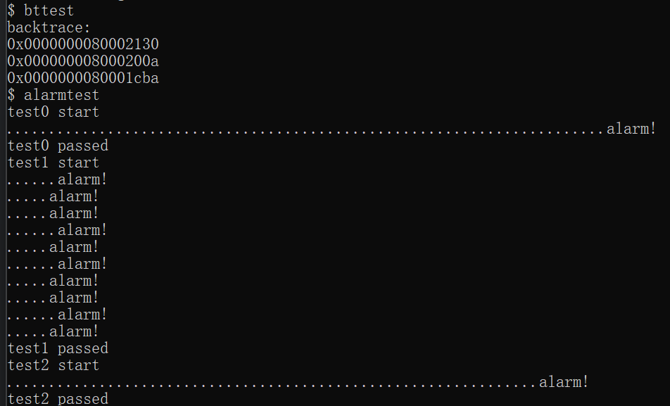
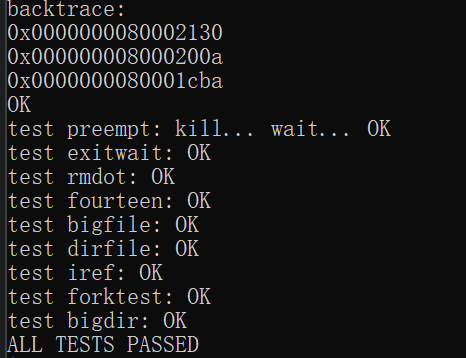
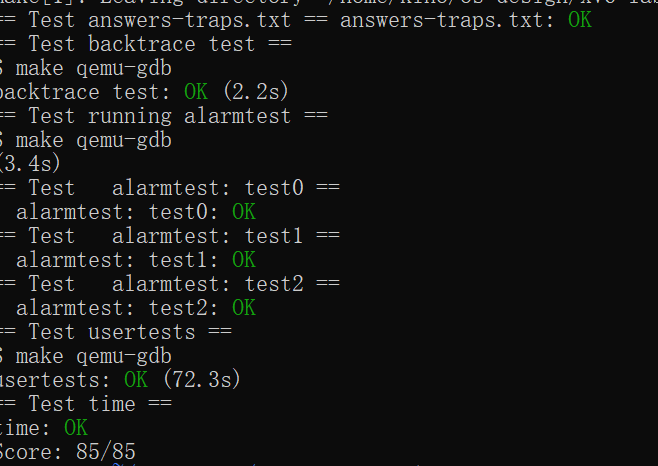

# 操作系统课程设计实验报告

## 阅读导航

- [Lab 4：Traps](#lab-4traps)
  - [一、实验目的](#一实验目的)
  - [二、实验内容](#二实验内容)
  - [三、实验结果与分析](#三实验结果与分析)
  - [四、实验中遇到的问题及解决方法](#四实验中遇到的问题及解决方法)
  - [五、实验心得](#五实验心得)

## Lab 4：Traps

### 一、实验目的

本实验基于 `traps` 分支，理解 RISC-V 函数调用约定、内核栈帧、系统调用陷入和定时器中断；实现内核调用栈回溯，以及由内核定时触发、用户态执行并能恢复现场的周期闹钟机制。

项目代码仓库：<https://github.com/kinosakuraxuan/learn_for_xv6>

### 二、实验内容

#### 1. 实验环境

```text
宿主系统：Windows + WSL 2（Ubuntu 22.04）
实验分支：lab4-traps
目标架构：RISC-V 64 位
Windows 目录：D:\OS design\xv6-labs-2021-traps
```

#### 2. RISC-V 汇编分析

函数参数使用 `a0`～`a7` 传递，示例中 13 位于 `a2`。优化器把 `f()` 和 `g()` 内联并把结果折叠为常量 12；本次构建中 `printf` 位于 `0x638`，`jalr` 返回地址为 `0x38`。小端示例输出 `He110 World`。

#### 3. 内核 backtrace

通过内联汇编读取 `s0` 帧指针。返回地址位于 `fp-8`，上一帧指针位于 `fp-16`；利用内核栈单页对齐的特点限制遍历范围，并在 `sys_sleep()` 与 `panic()` 中调用。

```c
while(fp >= bottom + 16 && fp < top){
  printf("%p\n", *(uint64 *)(fp - 8));
  fp = *(uint64 *)(fp - 16);
}
```

#### 4. sigalarm 与 sigreturn

进程控制块保存闹钟间隔、累计 tick、处理函数地址、重入状态和备份 trapframe。用户态定时器中断达到间隔后，内核复制完整寄存器现场并把 `epc` 改为处理函数地址；处理函数调用 `sigreturn()` 后恢复现场。`alarm_active` 阻止处理函数尚未返回时再次进入。

```c
memmove(&p->alarm_trapframe, p->trapframe,
        sizeof(struct trapframe));
p->alarm_active = 1;
p->trapframe->epc = p->alarm_handler;
```

### 三、实验结果与分析

以下图片均为实验环境中的现场运行截图。

在 xv6 中运行 `bttest` 与 `alarmtest`，可以看到内核调用栈地址被正确打印，三个定时闹钟测试全部通过：



*图 4-1 bttest 与 alarmtest 现场运行结果*

随后运行完整 `usertests`，所有回归测试均通过：



*图 4-2 usertests 完整回归测试结果*

最后运行官方评分脚本，backtrace、alarmtest、usertests 与用时检查均通过，获得 `85/85`：



*图 4-3 grade-lab-traps 官方评分结果*

| 测试 | 验证内容 | 结果 |
| --- | --- | --- |
| `answers-traps.txt` | 汇编问答 | OK |
| `backtrace test` | 栈帧回溯和地址解析 | OK |
| `alarmtest: test0` | 首次触发处理函数 | OK |
| `alarmtest: test1` | 周期触发与现场恢复 | OK |
| `alarmtest: test2` | 防止处理函数重入 | OK |
| `usertests` | 完整回归测试 | OK |
| `time.txt` | 实验耗时格式 | OK |

最终成绩：`Score: 85/85`。

### 四、实验中遇到的问题及解决方法

1. **回溯可能越过当前内核栈。** 保存由初始帧指针计算出的页边界，并在每次解引用前检查范围。
2. **处理函数返回后寄存器被破坏。** 触发时保存整个 `struct trapframe`，而不是只保存 `epc`。
3. **`sigreturn()` 的返回值会覆盖恢复后的 `a0`。** 先保存备份中的 `a0`，恢复 trapframe 后把它作为系统调用返回值。
4. **慢处理函数可能被再次打断。** 使用 `alarm_active` 屏蔽重入，直到 `sigreturn()` 完成恢复。

### 五、实验心得

本实验把系统调用、定时器中断和用户态返回路径连接起来。trapframe 不只是系统调用参数容器，而是用户程序完整执行现场；只有保存和恢复全部寄存器，处理函数才能像“临时插入”一样不破坏原程序。回溯实验也说明编译器约定和固定栈帧布局能为内核调试提供可靠基础。

## 参考资料

1. MIT PDOS, [Lab: Traps](https://pdos.csail.mit.edu/6.828/2021/labs/traps.html)
2. MIT PDOS, [xv6](https://pdos.csail.mit.edu/6.828/2021/xv6.html)
